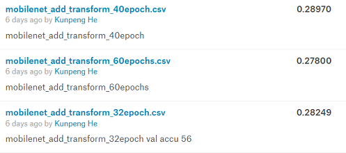

# 深度学习导论 Project-1 Tiny ImageNet Challenge 实验报告

## 队伍信息

- 队名：TeamName
- 成员：
  - 贺鲲鹏 2018011169
  - 李煜泽 2018011060
  - 范潇雄 2018011057
- 最终排名第 8 名，准确率 0.38610

## 最终版本方法

本队最终版本的网络采用了 xception 网络，所用参数为：`--epochs 100 –wd 1e-3`，训练数据为给出的 `train.txt` 中的所有图片，外加经过变形处理后的 `train.txt` 中的所有图片。所用的变形处理包括：水平翻转 `HorizontalFlip`，灰度图 `RandomGrayscale`，随机擦除 `RandomErasing`，仿射变换 `RandomAffine`。具体代码见随本报告一同提交的 `.py` 文件。

## 研究过程

开始时，我们直接套用了 torchvision 中已有的一些网络模型，如 ResNet18，ResNet34，ResNext，mobilenet 等。这些网络编写得较为完善，部分已有 Dropout 进行正则化，也可以更换 Optimizer 优化器；但它们的学习效果不尽如人意，平均正确率只有 0.2 左右，最优的 mobilenet_v2 的正确率为 0.24990。

我们注意到，这些网络在训练集上的正确率都能达到 95%以上，原始图片甚至能达到 100%，而在验证集上的正确率却只在 50~60%，这说明网络出现了严重的过拟合。即使采用了常用的正则化方法，网络的过拟合现象仍然非常严重。

在阅读相关文献[1]后，我们在图片输入网络前，先对其作了一些变形处理，意在提升网络识别对抗样本的准确率。变形包括仿射变换、灰度图、随机擦除三项。加入了变形的 mobilenet 在其他条件（epoch 数/各种参数）完全相同的情况下，正确率变成了 0.28249，大约上升了 3.2%。在此基础上，我们将不作变形的原图片与进行了变形的图片一同输入网络，正确率又上升了大约 1%，变成了 0.29280。但是过拟合仍然比较严重。如图，mobilenet 在 epoch 从 40 个增加为 60 个时，正确率反而下降了。

我们认为，出现如此严重的过拟合现象，根本原因是输入图像尺寸过小，较深的网络在对其学习的过程中获得的信息量非常有限，而较深网络如果本身过于简单，则拟合能力远远比正则化能力强，因此过拟合现象严重。

为了缓解过拟合现象，我们尝试了正则化能力较强、卷积核类型多的 Inception_v3、Inception_ResNet 等（部分代码不包含于 torchvision，尝试自行编写了 Inception_ResNet_v1 后，决定使用 `timm` 库直接调取模型），之后又尝试了它们的改进版 Xception。Xception 表现得较为良好，采用更强的预处理（原图与变形结合）后，过拟合明显下降，且在测试集上正确率达到了 0.33030。

最后，我们尝试调整 Xception 的参数。调大 Weight Decay 对于网络的正确率提升有很大作用，当其由 1e-5 调整为 1e-3 时，正确率达到了最大值 0.38610。

## 可能的进一步改进方法

我们想到、但尚未实现的改进措施如下。

在阅读了 Google 的论文《Self-training with Noisy Student improves ImageNet classification》[2]后，我们认为，该方法能提高准确率，主要依赖于两点：第一，令 300M 张原本无标识的图片有了标识，网络可以多出很多很多训练数据；第二，每次迭代中，学生网络得到的都是加入了噪声的图片，且学生网络总是一个比老师更大的网络，更能抓住图片的本质特征。

对于本次作业，不论是扩大训练集（需要在网络上爬取数据）还是构建一个更宽更大的网络，都需要一定的时间与精力。由于我们的时间安排不合理，并未能将所有的想法付诸实践，这也是我们从本次小作业中吸取到的教训之一。

此外，在《DenseNet Models for Tiny ImageNet Classification》[1]一文中提到，将 ResNet18 中 skip connection 的跨度加大，例如将其从跨越两层的连接变成跨越四层的连接，有助于防止过拟合。但是在我们的实践中，ResNet18 表现得实在差劲，故没有尝试这种修改，不知修改后它的表现能否出现质变。

## 反思与总结

总结起来，本次有几个地方做的不好，需要反思：

- 时间安排不当。这次本来应有较充裕的时间，但因为组内三人最初都集中精力干其余事项，导致后期才一起集中精力做这个项目，没有充分利用好时间。如今，我们吸取教训，已经开始第二个项目的初步调研，希望之后能比较顺利。
- 平台选取。最初我们以为腾讯智能钛可以使用，对可用平台调研不足。之后发现腾讯的平台使用的是 0.4 版本的 PyTorch 且驱动过久，才重新寻找可以使用的平台。由于网络问题，Colab 几乎不可用。最后选择使用了矩池云。希望下一个项目后期的训练过程可以少走一些弯路。

希望在下一次的 Project 中能吸取教训，取得更令人满意的成果

## 参考文献

[1] Abai Z, Rajmalwar N. DenseNet Models for Tiny ImageNet Classification[J]. arXiv preprint arXiv:1904.10429, 2019.

[2] Xie Q, Hovy E, Luong M T, et al. Self-training with Noisy Student improves ImageNet classification[J]. arXiv preprint arXiv:1911.04252, 2019.